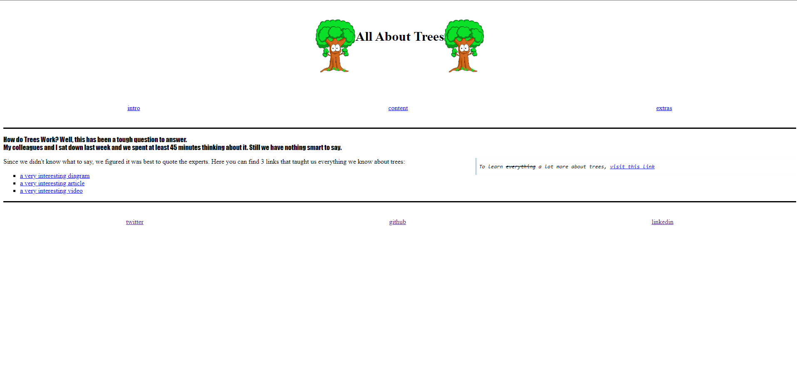

# Planning and Collaborating

> The main objective this module is to learn how to planning and collaborate on
> software projects, There is some requirements to start collaborating in the
> team :

       - A repository
       - Planning documents
       - Issues
       - labels, milestones and assignees
       - A Project Board
       - Pull Requests + code review
         To be a good developer you do not need to master all the programming languages you just need to learn how to plan, collaborate and communicate with your developer friends

## All About Trees

Trees are the backbone of sustaining the life of our planet. That is why we are
developing this website to raise awareness of the following points: -Trees are
the lungs of the planet and without them, we cannot get enough oxygen for life
-Trees are an important source for construction and human development -We must
teach our children how to take care of nature and grow plants and trees to reach
a sustainable future.

## Table of contents

- [Planning and Collaborating](#planning-and-collaborating)
  - [All About Trees](#all-about-trees)
  - [Table of contents](#table-of-contents)
  - [Screenshots](#screenshots)
  - [Technologies](#technologies)
  - [Contact](#contact)

## Screenshots

## Technologies

- Node 14.16.0
- VSC code
- JavaScript
- ...
- ...

## Contact

By [Name]
