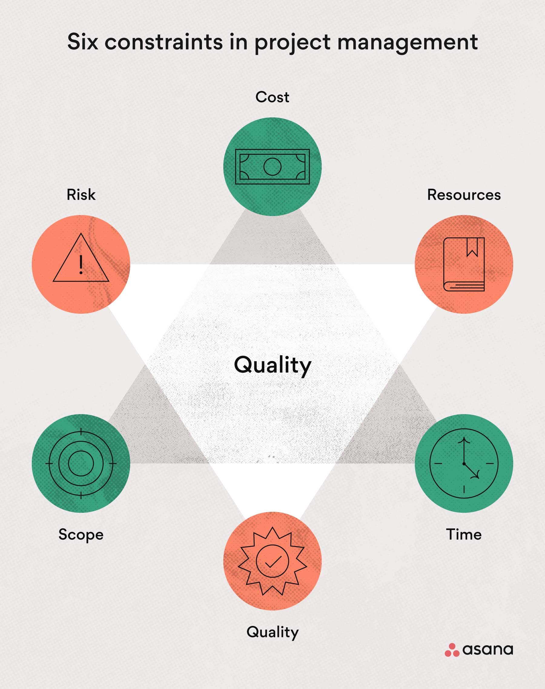

# constraints

> constraints are the general restrictions that limit the project management.

|                                           |
| ----------------------------------------- |
|  |

## External

- **UI Design**
  > [our template](https://talmurshidi.github.io/ABT/)
- **Color schemes**
  > `#ffffff` for background `#000000` for text color `#0000EE` for link color
  > `#551A8B` for visited link color

- **Technologies**

  > - MarkDown
  > - Git & GitHub
  > - HTML & CSS
  > - VScode
  > - Node & npm

## Internal: Voluntary

> 4 hours a day (divide the work on 5 of us)

## Internal: Involuntary

- **Our Project deadline**

> 5 days
