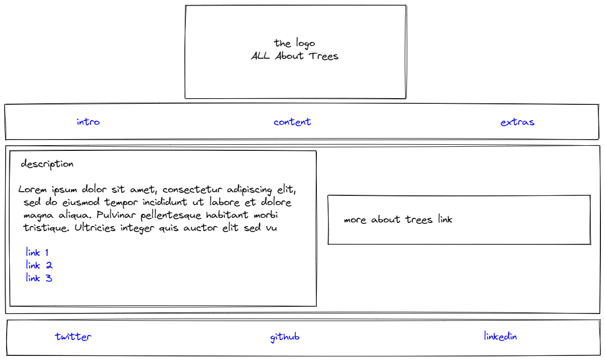

# All About Trees

---

## User Story Dependencies

[download SVG wireframe screenshot](images/wireframe.svg)

---

## WIREFRAME

---

## 0.Setup

- [ ] create index.html
- [ ] create style.css
- [ ] create image folder
- [ ] link css to html file

---

## 1. Title

## As a user I want to read page title

- [ ] This user story is developed on branch `01-title`.
- [ ] Add title tag in the head of index.html.
- [ ] This branch is merged to `master` branch after completion.

### Logo

- [ ] This user story is developed on branch `01-logo-html`.
- [ ] Add image tag to index.html.
- [ ] Add logo to images folder.
- [ ] This branch is merged to `master` branch after completion.
- [ ] This user story is developed on branch `01-logo-css`.
- [ ] there is a prominent logo in the top center of the web page
- [ ] This branch is merged to `master` branch after completion.

### Description

- [ ] This user story is developed on branch `01-Description`.
- [ ] Add description to index.html.
- [ ] Add style for description in style.css.
- [ ] There is a prominent description on the Home web page.
- [ ] This branch is merged to `master` branch after completion.

### Navbar

- [ ] This user story is developed on branch `01-Navbar`.
- [ ] Create navbar in index.html.
- [ ] Use `` for the links.
- [ ] Add style for navbar in style.css.
- [ ] Use matching colors so that it stands out.
- [ ] There is a prominent navbar top of the web page under the logo.
- [ ] This branch is merged to `master` branch after completion.

### Contact links in footer

- [ ] This user story is developed on branch `01-Contact-links-footer`.
- [ ] Create navbar in footer inside index.html.
- [ ] Use `` for the links.
- [ ] There is a prominent contact link in navbar at the footer of the website.
- [ ] This branch is merged to `master` branch after completion.

### Social media links in footer

- [ ] This user story is developed on branch `01-Social-media-links-footer`.
- [ ] Create social media links with logo's or images.
- [ ] There is a prominent social media links in navbar at the footer of the
      website.
- [ ] This branch is merged to `master` branch after completion.

### Blog section in top navbar

- [ ] This user story is developed on branch `01-blog-section`.
- [ ] Create a blog section that talks about threes.
- [ ] There is a blog section in the top navbar.
- [ ] This branch is merged to `master` branch after completion.
